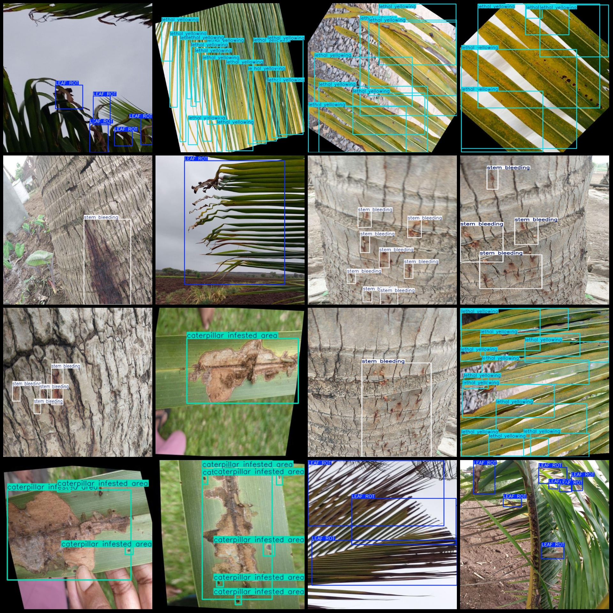
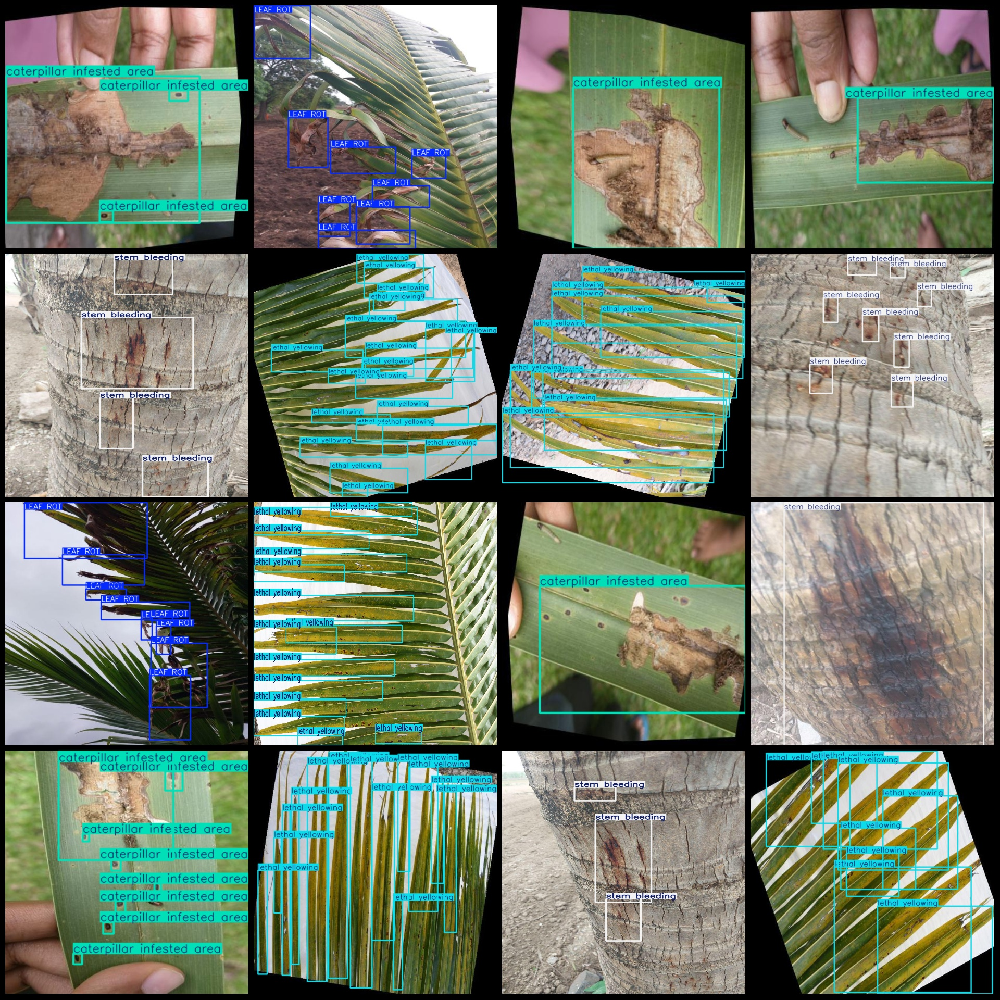

# Coconut Tree Disease Detection Dataset VOC+YOLO Format with 2601 Images in 4 Categories

Please note that the dataset contains a large number of enhanced images, mainly rotation enhancements. Please carefully review the images.
The dataset format is Pascal VOC format + YOLO format (excluding the split path in the txt file, only containing JPG images along with corresponding VOC format xml files and YOLO format txt files).
Number of images (JPG file count): 2601
Number of annotations (xml file count): 2601
Number of annotations (txt file count): 2601
Number of annotation categories: 4
Annotation categories names (note that the order of categories in YOLO format may not correspond to this, but is based on the labels folder 'classes.txt'): ["LEAF ROT", "caterpillar infested area", 
"lethal yellowing", "stem bleeding"]
Number of bounding box counts for each category:
- LEAF ROT (leaf rot) bounding boxes = 2804
- caterpillar infested area (area infested by caterpillars) bounding boxes = 3164
- lethal yellowing (lethal yellowing) bounding boxes = 5673
- stem bleeding (bleeding from stems) bounding boxes = 2847
Total bounding box count: 14488
Image resolution: Multi-resolution images, such as 416x416, 640x640, etc.
Using labeling tool: labelImg
Labeling rules: Draw bounding boxes for each category
Important Notice: The dataset does not include any partitioning of training, validation, or testing sets, which requires custom division.
Special Declaration: This dataset does not guarantee any accuracy of trained models or weight files.
Image Preview:

## Images

Here is a pay link on Stripe ( https://buy.stripe.com/3cs8yP7sY87d0vu9AB ). Please contact me lonlonago@foxmail.com after funding $89, and I will send you a complete data files , thank you!

